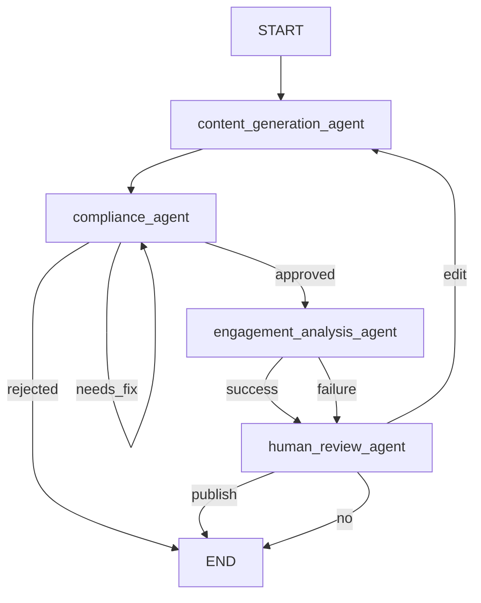

# Design Document: Social Media Multi-Agent System

## Overview

A LangGraph-based multi-agent pipeline that orchestrates content generation, compliance checking, engagement analysis, and human review for social media posts. The system uses AWS AgentCore persistent memory to retain cross-session context (past posts, user preferences, platform history), enabling content that improves over time.

The pipeline is a directed graph compiled from a `StateGraph`. A single `Pipeline_State` TypedDict flows through four specialized agent nodes, with conditional edges handling compliance routing and human review decisions. AWS AgentCore replaces the in-process `InMemorySaver` so state survives across deployments and sessions.

---

## Architecture



Key design decisions:
- **LangGraph `StateGraph`** manages the pipeline; all routing is expressed as conditional edges, keeping orchestration logic declarative.
- **AWS AgentCore `AgentCoreMemorySaver`** is the checkpointer, injected at compile time and passed via `RunnableConfig` per invocation.
- **`memory_id`** is read from the `AGENTCORE_MEMORY_ID` environment variable — never hardcoded.
- **Pydantic output models** (`ContentCreationOutput`, `ComplianceResult`, `EngagementAnalysis`) enforce type safety at every node boundary.

---

## Components and Interfaces

### Module Layout

```
backend/
├── agents/
│   ├── supervisor.py            # StateGraph definition, node wiring, conditional edges
│   ├── content_creation.py      # ContentCreationAgent + ContentCreationOutput model
│   └── compliance_agent.py      # ComplianceResult model + compliance_node function
│                                # (renamed from governent-compliance-agent.py)
├── services/
│   ├── image_generation.py      # generate_image() — Bedrock SDXL
│   └── engagement.py            # EngagementAnalysis model + engagement_node function
│                                # (caption-generator.py removed — duplicate)
└── requirements.txt
```

### supervisor.py

Responsibilities:
- Define `PipelineState` TypedDict
- Build and compile the `StateGraph` with `AgentCoreMemorySaver`
- Implement routing functions (`route_compliance`, `route_human_review`)
- Validate required fields before each node invocation

Public interface:
```python
def build_graph() -> CompiledGraph: ...
def run_pipeline(query: str, platform: str, config: RunnableConfig) -> PipelineState: ...
```

### content_creation.py

Responsibilities:
- `ContentCreationAgent.create_social_post(self, topic, platform, memory_context)` — the single canonical method
- Platform-specific prompt construction (LinkedIn ≤5 hashtags, Instagram 10–30 hashtags)
- Calls `generate_image()` from `backend.services.image_generation`

Public interface:
```python
class ContentCreationOutput(BaseModel):
    caption: str
    image_prompt: str
    hashtags: list[str]
    platform: str

class ContentCreationAgent:
    def create_social_post(
        self, topic: str, platform: str, memory_context: dict | None
    ) -> ContentCreationOutput: ...
```

### compliance_agent.py

Responsibilities:
- Invoke LLM with compliance prompt
- Parse response into `ComplianceResult`; return `rejected` with fallback reason on parse failure

Public interface:
```python
class ComplianceResult(BaseModel):
    status: Literal["approved", "rejected", "needs_fix"]
    reason: str
    corrected_text: str | None = None

def compliance_node(state: PipelineState) -> PipelineState: ...
```

### engagement.py (service)

Responsibilities:
- Invoke LLM with engagement analysis prompt, optionally incorporating historical data from `memory_context`
- Return `EngagementAnalysis`; on failure, return `None` so supervisor routes to human review with null analysis

Public interface:
```python
class EngagementAnalysis(BaseModel):
    expected_engagement_score: float   # 0.0–1.0
    predicted_audience_reaction: str
    post_impact_summary: str

def engagement_node(state: PipelineState) -> PipelineState: ...
```

### image_generation.py (service)

Responsibilities:
- Invoke AWS Bedrock Stable Diffusion XL
- Return base64-encoded image string
- Raise a descriptive exception on API failure (no partial results)

Public interface:
```python
def generate_image(prompt: str) -> str: ...  # base64
```

---

## Data Models

### PipelineState

```python
from typing_extensions import TypedDict
from typing import Optional

class PipelineState(TypedDict):
    query: str
    platform: str
    tasks: list[str]
    generated_content: Optional[ContentCreationOutput]
    compliance_result: Optional[ComplianceResult]
    engagement_analysis: Optional[EngagementAnalysis]
    human_decision: Optional[str]          # "publish" | "edit" | "no"
    edit_instructions: Optional[str]
    memory_context: Optional[dict]
```

All `Optional` fields default to `None` at pipeline start. Nodes read only the fields they need and return a partial dict that LangGraph merges into the shared state.

### ContentCreationOutput

```python
class ContentCreationOutput(BaseModel):
    caption: str
    image_prompt: str
    hashtags: list[str]
    platform: str
```

### ComplianceResult

```python
class ComplianceResult(BaseModel):
    status: Literal["approved", "rejected", "needs_fix"]
    reason: str
    corrected_text: str | None = None
```

### EngagementAnalysis

```python
class EngagementAnalysis(BaseModel):
    expected_engagement_score: float   # 0.0–1.0
    predicted_audience_reaction: str
    post_impact_summary: str
```

---

## Conditional Routing Logic

### `route_compliance(state: PipelineState) -> str`

```python
def route_compliance(state: PipelineState) -> str:
    status = state["compliance_result"].status
    if status == "approved":
        return "engagement_analysis_agent"
    elif status == "needs_fix":
        # corrected_text has already been merged into generated_content by compliance_node
        return "compliance_agent"
    else:  # rejected
        return END
```

### `route_human_review(state: PipelineState) -> str`

```python
def route_human_review(state: PipelineState) -> str:
    decision = state["human_decision"]
    if decision == "publish":
        return END
    elif decision == "edit":
        return "content_generation_agent"
    else:  # "no"
        return END
```

### Graph Wiring

```python
graph = StateGraph(PipelineState)
graph.add_node("content_generation_agent", content_node)
graph.add_node("compliance_agent", compliance_node)
graph.add_node("engagement_analysis_agent", engagement_node)
graph.add_node("human_review_agent", human_review_node)

graph.add_edge(START, "content_generation_agent")
graph.add_edge("content_generation_agent", "compliance_agent")
graph.add_conditional_edges("compliance_agent", route_compliance)
graph.add_edge("engagement_analysis_agent", "human_review_agent")
graph.add_conditional_edges("human_review_agent", route_human_review)
```

---

## AWS AgentCore Memory Integration

```python
import os
from amazon_agentcore.memory import AgentCoreMemorySaver

memory_id = os.environ["AGENTCORE_MEMORY_ID"]

checkpointer = AgentCoreMemorySaver(
    memory_id=memory_id,
    region_name=os.environ.get("AWS_REGION", "us-east-1"),
)

compiled_graph = graph.compile(checkpointer=checkpointer)
```

Per-invocation config passes the thread ID so AgentCore can scope memory to a session:

```python
config = RunnableConfig(configurable={"thread_id": session_id})
result = compiled_graph.invoke(initial_state, config=config)
```

On `publish`, the supervisor node writes the completed `PipelineState` back to memory so future sessions can load past posts, hashtags, and engagement scores.

---

## Code Quality Fixes Required

The following changes must be made to the existing codebase before the new design is implemented:

1. **Rename** `backend/agents/governent-compliance-agent.py` → `backend/agents/compliance_agent.py`
2. **Fix indentation** of `create_social_post` in `Content_creation.py` — it is currently a module-level function with wrong indentation; it must become a proper instance method with `self` as the first parameter
3. **Remove** `backend/services/caption-generator.py` — it is an exact duplicate of `image_generation.py`
4. **Replace** `InMemorySaver` with `AgentCoreMemorySaver` in `Supervisor.py`
5. **Remove** the hardcoded `memory` literal in `Supervisor.py`; read from `os.environ["AGENTCORE_MEMORY_ID"]`
6. **Fix** `ContentCreationOutput` fields — add `caption`, `image_prompt`, `hashtags` fields; current model only has `content`, `platform`, `response`
7. **Fix** imports in `Supervisor.py` — `from backend.agents.compliance_agent import ...`

---

## Correctness Properties

*A property is a characteristic or behavior that should hold true across all valid executions of a system — essentially, a formal statement about what the system should do. Properties serve as the bridge between human-readable specifications and machine-verifiable correctness guarantees.*

### Property 1: Compliance routing is exhaustive and correct

*For any* `ComplianceResult` with status `approved`, `needs_fix`, or `rejected`, the `route_compliance` function must return `"engagement_analysis_agent"`, `"compliance_agent"`, or `END` respectively — and must never return an unrecognized node name.

**Validates: Requirements 1.4, 1.5, 1.6**

---

### Property 2: Human review routing is exhaustive and correct

*For any* `human_decision` value of `"publish"`, `"edit"`, or `"no"`, the `route_human_review` function must return `END`, `"content_generation_agent"`, or `END` respectively. Any value outside these three must raise a `ValueError`.

**Validates: Requirements 1.8, 1.9, 6.2**

---

### Property 3: Content generation output is structurally complete

*For any* valid topic, platform, and memory context, `ContentCreationAgent.create_social_post` must return a `ContentCreationOutput` where `caption`, `image_prompt`, `hashtags`, and `platform` are all non-null and non-empty.

**Validates: Requirements 3.1, 3.3**

---

### Property 4: Platform hashtag count invariant

*For any* LinkedIn post, the `hashtags` list must have length ≤ 5. *For any* Instagram post, the `hashtags` list must have length between 10 and 30 inclusive.

**Validates: Requirements 3.4, 3.5**

---

### Property 5: Hashtag novelty relative to recent memory

*For any* generated post where memory context contains at least one prior post for the same platform, none of the hashtags in the new post should appear in the union of hashtags from the three most recent prior posts for that platform.

**Validates: Requirements 3.2**

---

### Property 6: ComplianceResult invariants

*For any* content string passed to `compliance_node`, the returned `ComplianceResult` must satisfy: (a) `status` is exactly one of `"approved"`, `"rejected"`, `"needs_fix"`; (b) when `status == "needs_fix"`, `corrected_text` is not `None`; (c) when `status == "rejected"`, `reason` is a non-empty string.

**Validates: Requirements 4.1, 4.2, 4.3, 4.4**

---

### Property 7: EngagementAnalysis structural invariant

*For any* approved content passed to `engagement_node`, the returned `EngagementAnalysis` must have `expected_engagement_score` in the range [0.0, 1.0], and both `predicted_audience_reaction` and `post_impact_summary` must be non-empty strings.

**Validates: Requirements 5.1**

---

### Property 8: Unsupported platform raises validation error before any agent runs

*For any* platform string not in the supported set `{"linkedin", "instagram"}`, calling `run_pipeline` must raise a validation error and must not invoke any agent node.

**Validates: Requirements 7.3**

---

### Property 9: Pipeline state merge completeness

*For any* agent node that returns a partial state dict, the resulting `PipelineState` after the node executes must contain all fields from before the node plus the updated fields — no fields should be dropped.

**Validates: Requirements 9.2**

---

### Property 10: Missing required field raises ValueError

*For any* node invocation where a field required by that node is `None` or absent in `PipelineState`, the supervisor must raise a `ValueError` that names the missing field.

**Validates: Requirements 9.3**

---

## Error Handling

| Scenario | Handling |
|---|---|
| LLM response unparseable in compliance node | Return `ComplianceResult(status="rejected", reason="Compliance check failed to parse response")` |
| Bedrock API failure in image generation | Raise `RuntimeError(f"Image generation failed: {e}")` — no partial result returned |
| Engagement analysis timeout / exception | Log error; set `engagement_analysis=None` in state; route to `human_review_agent` |
| Unsupported platform in initial request | Raise `ValueError(f"Unsupported platform '{platform}'. Supported: linkedin, instagram")` before any node runs |
| Missing required state field at node entry | Raise `ValueError(f"Required field '{field}' is missing from PipelineState")` |
| `AGENTCORE_MEMORY_ID` env var not set | Raise `EnvironmentError("AGENTCORE_MEMORY_ID environment variable is not set")` at startup |

---

## Testing Strategy

### Dual Testing Approach

Both unit tests and property-based tests are required. They are complementary:
- Unit tests catch concrete bugs at specific examples and integration points
- Property tests verify universal correctness across the full input space

### Property-Based Testing

**Library**: `hypothesis` (Python)

Each property test runs a minimum of 100 iterations. Tests are tagged with a comment referencing the design property.

Tag format: `# Feature: social-media-multi-agent-system, Property {N}: {property_text}`

Each correctness property above maps to exactly one property-based test:

| Property | Test description |
|---|---|
| P1: Compliance routing | Generate random `ComplianceResult` status values; assert `route_compliance` returns correct node |
| P2: Human review routing | Generate random decision strings; assert `route_human_review` returns correct node or raises |
| P3: Content output completeness | Generate random topic/platform/memory_context; assert all output fields non-null |
| P4: Platform hashtag count | Generate random topics for LinkedIn and Instagram; assert hashtag count bounds |
| P5: Hashtag novelty | Generate random memory context with prior posts; assert no hashtag overlap with 3 most recent |
| P6: ComplianceResult invariants | Generate random content strings; assert all three invariants hold on output |
| P7: EngagementAnalysis invariants | Generate random approved content; assert score in [0,1] and strings non-empty |
| P8: Unsupported platform validation | Generate random strings not in supported set; assert ValueError raised before any node |
| P9: State merge completeness | Generate random partial state updates; assert no fields dropped after merge |
| P10: Missing field ValueError | Generate states with each required field set to None; assert ValueError names the field |

### Unit Tests

Focus on:
- Specific routing examples (e.g., `approved` → `engagement_analysis_agent`)
- Integration between `content_generation_agent` and `image_generation` service
- `AgentCoreMemorySaver` is used as checkpointer (inspect compiled graph)
- `memory_id` is read from env var (set env var in test, verify value used)
- Engagement failure path routes to human review with `null` analysis
- Human review `publish` path triggers memory write
- `caption-generator.py` does not exist in the codebase (deletion verified)
